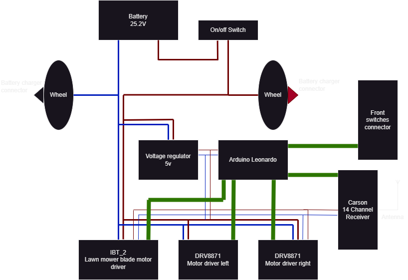
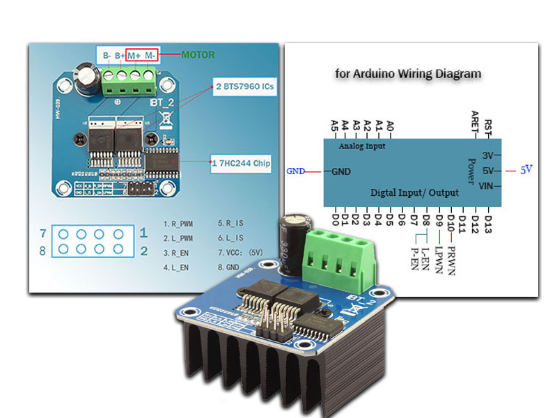
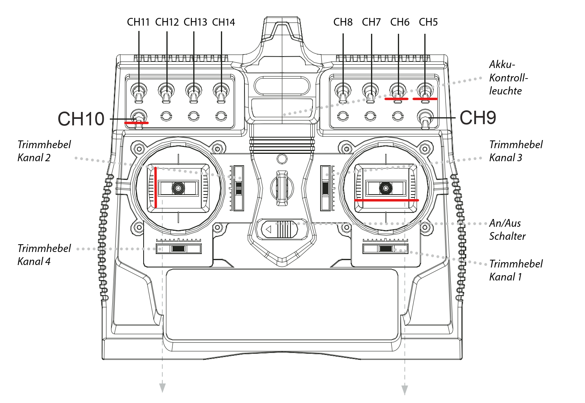

# Lawn Mover Remote Control Upgrade

This repository contains the code for the remote control upgrade of a Wiper Blitz lawn mover.

⚠️ If someone really rebuild this, please be careful. The lawn mower is a dangerous machine. It is not a toy. It can cause serious injuries. Especially if you work on the electronics or debug the program and turn on the blade unintentional. I recommend removing the blade when working on the lawn mower. Also, the lawn mower does not contain a position sensor. The blade can run when the lawn mower is on its back. I take no responsibility for any damage or injury caused by the use of this instructions and code. ⚠️ 

## Background

A long time ago we bought a Wiper Blitz lawn mower. This is an automatic lawn mower that works without cables that you have to lay. Instead, it has sensors that detect the lawn edges and obstacles. Sounds good, but it didn't work very well, at least in our garden. Our lawn is connected to the neighbour's lawn and so of course the sensors are not able to detect the border. So the lawnmower drives over the lawn edges and cuts the neighbour's lawn. That's not very nice. I have to admit that we should have known that before we bought it. But we didn't. So we had to find a solution.

Instead of supervising the lawnmower when it runs or building obstacles like a fence, I decided to upgrade the lawnmower so that it can be controlled remotely.

## Technical Overview

The lawn mower has three motors. One large motor with a power of 120 W for the blade of the lawn mower. The two smaller motors drive the wheels. The motors are controlled by an Arduino Leonardo board. As a driver for the Balde motor I used a `BTS 7960` based board. For the smaller motors two `DRV8871` based boards are used.

The connection to the Carson 14-channel remote control, which is also used for a remote controlled boat of my son, is made by the corresponding 14-channel receiver from Carson.

The battery is a 25.2V Li-Ion battery with 6.9 Ah. The charge controller is integrated in the battery housing. The charger is connected via the charging ports on the wheels.

## Hardware

### Arduino controller

https://docs.arduino.cc/hardware/leonardo

### Motor driver for blade motor

BTS7960 43A IBT-2 High Current Half-Bridge Configuration PWM Driver Board DIY Smart Car Motor Driver Module

https://www.amazon.com/BTS7960-Current-Half-Bridge-Configuration-Driver/dp/B0BGR92TCD

[Datasheet BTS7960b](resources/datasheet-bts7960b.pdf)

### Motor driver for wheel motors

DRV8871 3.6A Dual Brushed DC Motor Driver

https://www.play-zone.ch/de/adafruit-drv8871-dc-motor-driver-breakout-board-3-6a-max.html

[Datasheet DRV8871](resources/datasheet-DRV8871.pdf)

### Voltage Step-Up Converter

https://www.play-zone.ch/de/lm2577-dc-dc-aufwartswandler-modul-mit-lcd-anzeige.html

This module converts the microcontroller's power supply into a higher, adjustable voltage. In this use case we step down the voltage from 25.2V from the battery to 5V for the arduino and the controller of the driver boards.

[Datasheet LM2577](resources/datasheet-LM2577.pdf)

### Radio Control Sender

Artikelnummer: 500501003
Artbez.: Reflex Stick MULTI PRO 14 Kanal 2.4 GHz

https://www.carson-modelsport.com/carson_de/ersatzteile-zubehoer/rc-zubehoer/fernsteueranlagen/fs-reflex-stick-multi-pro-24g-14ch-500501003-de.html

[Manual](resources/manual-ReflexStickMultiPro14.pdf)

### Radio Control Receiver

Art.Nr.: 500501540
Art.bezeichnung: Empfänger REFLEX Stick Multi Pro 14 Kanal 2,4 GHz

https://www.carson-modelsport.com/carson_de/ersatzteile-zubehoer/rc-zubehoer/fernsteueranlagen/empfaeng-reflex-stick-multi-pro-14k-24g-500501540-de.html

### Connection between receiver and arduino

| Arduino | Receiver | Function                              |
| ------- | -------- | ------------------------------------- |
| A0      | CH1      | Drive left/right, right joystick      |
| A1      | CH2      | unused                                |
| A2      | CH3      | Drive forward/backward, left joystick |
| A3      | CH5      | Enable Drive                          |
| A4      | CH6      | Velocity blade                        |
| A5      | CH10     | Enable blade                          |

### Connection between arduino and motor driver boards (balde)

| Arduino | Driver |
| ------- | ------ |
| 2       | L_PWM  |
| 3       | L_EN   |
| 4       | R_PWN  |
| 5       | R_EN   |

## Usage

- Enable drive: CH5
- Enable blade: CH10
- Velocity blade: CH6
- Drive forward/backward: left joystick
- Drive left/right: right joystick